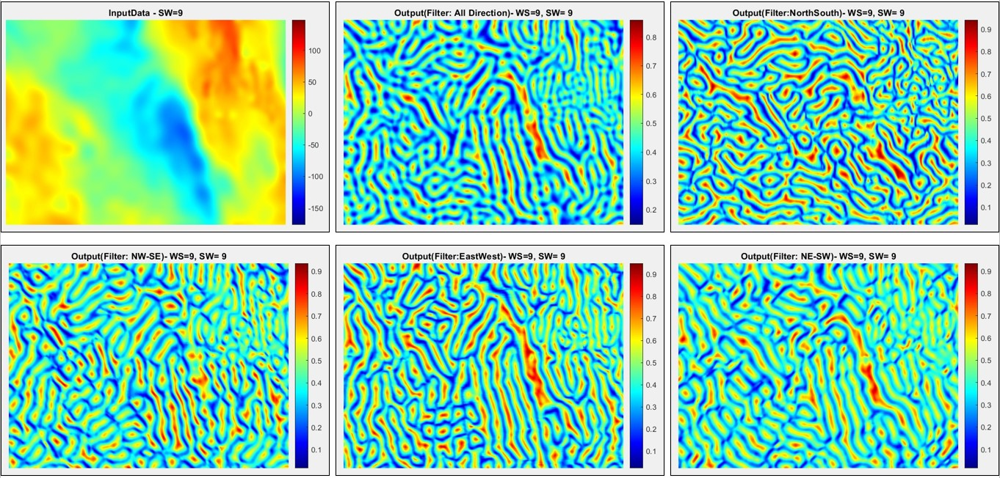
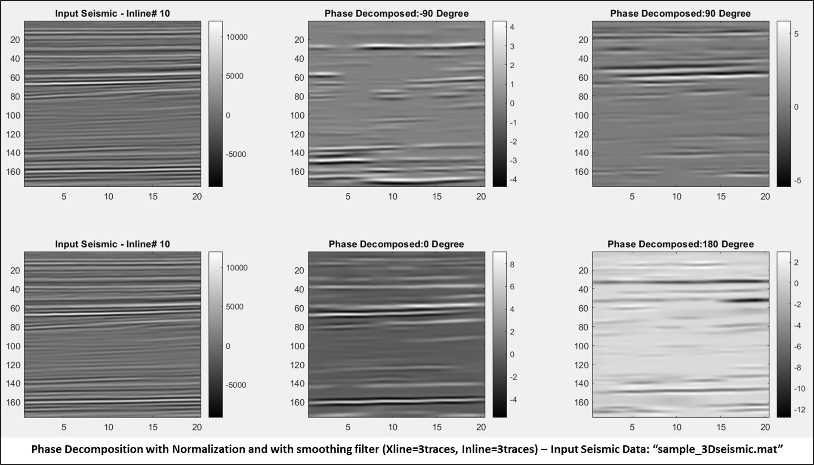
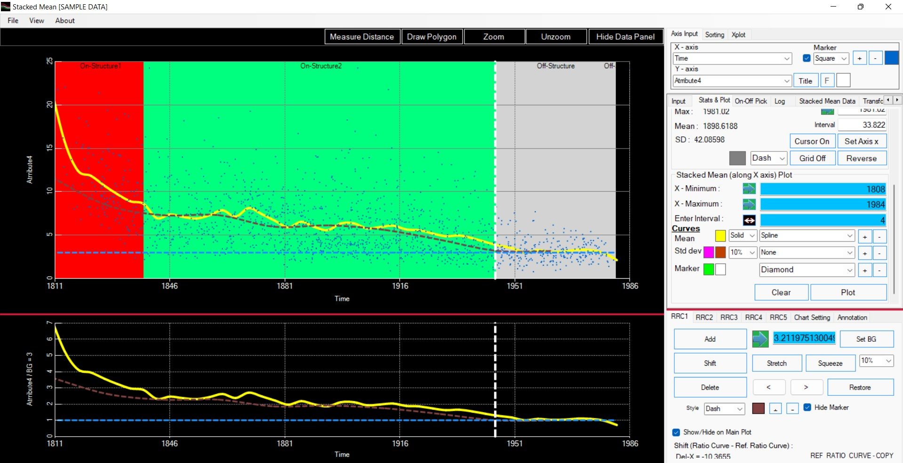

## Portfolio

**My journey to the world of Machine Learning & AI has already begun. Below is the list of some of the project programs developed previously.**

------------------------------------------------------------------------------------------

### Project 1: Gray Level Transformed Directional Normalized Standard Deviations (NSTD) for Edge Detection

**Link: https://github.com/sinhapm/GravMagGreyTransDirectionEdge.git**

**Scope of Program Field: Gravity, Magnetic & Remote Sensing Dataset**

_Platform: MATLAB_

The program calculates the Gray Level Transformed Directional Normalized Standard Deviations (NSTD) for Edge Detection.

It takes the 2D gridded points input (Irap Classic Points format) such as Input File Format (X(Integer) Y(Integer) Z(Float)) - XY in ascending order top to bottom direction of Input data: 1. West to East: Left to Right, 2. South to North: Top to Bottom

**Sample output image**

Open source Free Air Gravity data downloaded from the following site: https://topex.ucsd.edu/cgi-bin/get_data.cgi

------------------------------------------------------------------------------------------

### Project 2: Phase-Decomposition-3D-Seismic-Data-Odd-Even-Function-Method

**Link: https://github.com/sinhapm/Phase-Decomposition-3D-Seismic-Data-Odd-Even-Function-Method.git**

**Scope of Program Field: Attribute Analysis - 3D Seismic Phase Decomposition**

_Platform: MATLAB(R2020), Opendtect 6.4_

The program performs 3D seismic data Phase Decomposition based on Odd-Even function. It computes only the odd components (-90 degree, 90 degree) and the even components (+/-180 degree, 0 degree) from the 3D seismic data.

Sample data ("**sample_3Dseismic.mat**") outputs test: script: "Test_run_codes_pdoed3D_sample_3Dseismic_matfile.m"

------------------------------------------------------------------------------------------

### Project 3: On-Off-Amplitude-Analysis [Stacked Mean]
**The Program performs the on-off structural amplitude profiling based on common interval stacking.**

**Link: https://github.com/sinhapm/On-Off-Amplitude-Analysis---Stacked-Mean.git**

**Scope of Program Field: Attribute Analysis based on point data set of 3D seismic data structural interpretation - Interval Based Stacked Mean Amplitude Profiling**

_Development Platform (Windows): Visual Basic_

_Utility Program : Stacked_Mean (Application file) / Setup file only_

The program carries out the mean amplitude profiling of the 3D seismic point data set based on set interval. A ratio curve can be estimated by assigning the background level and same can be analysed with the know reference curve/s (maximum of 5 reference curves can be added). Reference curve/s can be shifted, stretched, squeezed along the x -axis.

**Sample image**:

------------------------------------------------------------------------------------------

